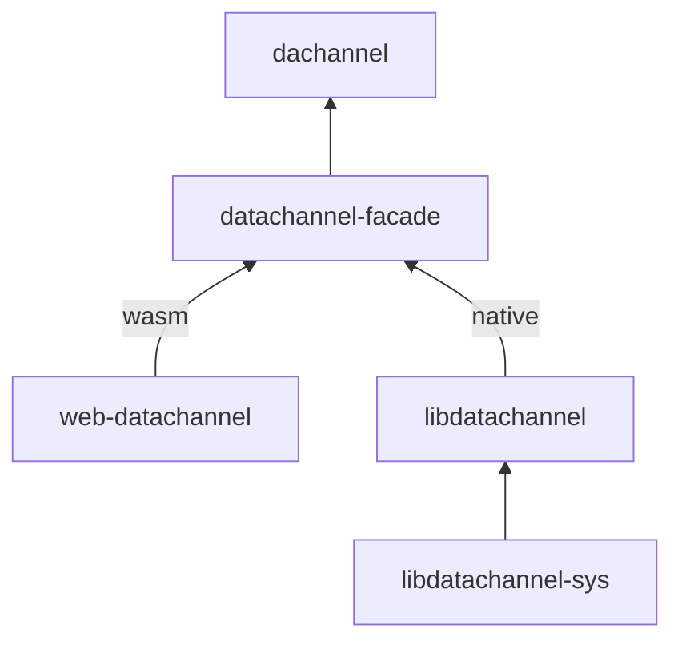

# dachannel

dachannel is a WebRTC DataChannel library for both web (using browser WebRTC) and native (using [libdatachannel](https://libdatachannel.org/)). It is comprised of:

-   **`libdatachannel` (native) / `web-datachannel` (web)**

    Platform-level libraries for DataChannel support.

-   **datachannel-facade**

    A facade over platform libraries to expose an identical API for DataChannels on all platforms.

-   **dachannel**

    A high-level, idiomatic DataChannel library.

Each level of the stack is usable independently. If you want an unopinionated platform-independent wrapper, you can use `datachannel-facade`. If you just need a Rust wrapper of libdatachannel, you can use `libdatachannel`.
